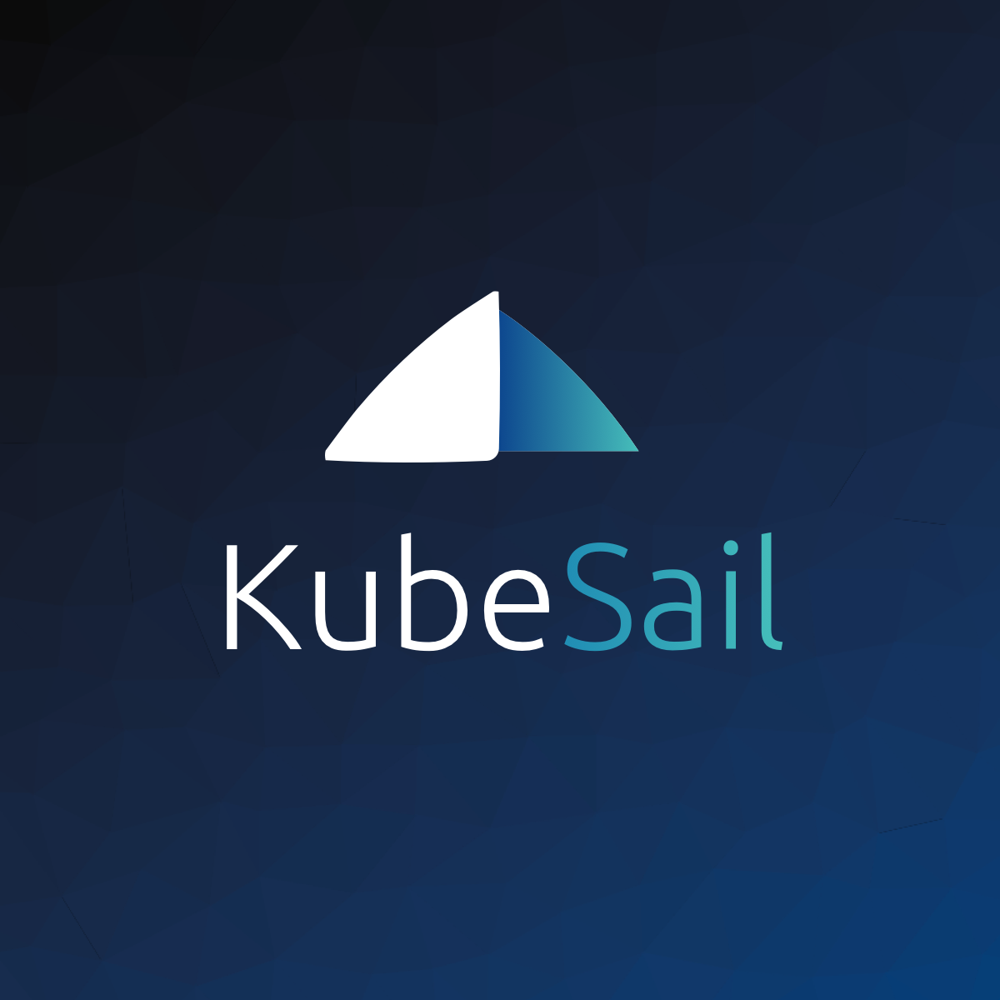

# deploy-node-app

[](https://www.npmjs.com/package/deploy-node-app)

Deploy your node.js app to Kubernetes or Docker with a single command. No config required.

Supports any Kubernetes cluster, including the following:

- Google Kubernetes Engine
- Amazon EKS
- DigitalOcean Kubernetes
- KubeSail (**completely free Kubernetes hosting**)
- Custom Clusters

### Instructions

Just run `npx deploy-node-app` in your node project.


### Prerequisites

- [Docker](https://www.docker.com/get-started)
- [NodeJS / npm](https://nodejs.org/en/) - NPM includes the `npx` utility needed to run this package without being installed
- [kubectl](https://kubernetes.io/docs/tasks/tools/install-kubectl/) - required for creating your deployment, and recommended for managing your deployment after created

### What does this tool do?

After answering a few questions about your app, this tool can:

1. Create a Dockerfile (if needed)
1. Build a Docker image
1. Create a Kubernetes deployment file
1. Deploy your app on a Kubernetes cluster
   - Configure a free namespace on [KubeSail](https://kubesail.com) (if desired)

### Usage and examples

```
Usage: deploy-node-app [env]

Options:
  -V, --version               output the version number
  --generate-default-env      Generates default environment variables, like database passwords
  --generate-local-ports-env  Generates environment variables for connecting to docker-compose services
  -n, --no-build              Don't build and push docker container
  -N, --no-confirm            Skip public docker hub confirmation prompt
  -d, --no-push               Don't push to docker registry
  -D, --no-deploy             Don't deploy to kubernetes
  -O, --overwrite             Overwrite local files
  -s, --skip metamodule       name of metamodule to skip
  -S, --safe                  Do not overwrite local files
  -f, --format [type]         Output config format [k8s|compose] (default: "k8s")
  -o, --output [filename]     File for config output. "-" will write to stdout. Default is docker-compose.yaml or deployment.yaml depending on format
  -h, --help                  output usage information
```

By default, `deploy-node-app` will write a few files to your directory, depending on the chosen output. You will be prompted if any files need to be updated or overwritten (use --overwrite to ignore prompts).

# Simplest Usage

Simply run `npx deploy-node-app` in your Node.js repository. The tool will attempt to prompt you when it needs answers to questions, but should happily support almost all Node.js applications, including static front-end's created by `create-react-app`.

# Local Development

`deploy-node-app` can deploy to either a Docker or Kubernetes installation locally:

Deploying to local docker-compose:

`deploy-node-app local -f compose`

- Writes a local Dockerfile
- Scans dependencies for [metamodules](https://github.com/create-node/create-node-app#metamodules), adding services automatically
- Writes a local **docker-compose.yaml** based on your needs
- Builds container image
- Pushes container image to chosen repository
- Calls `docker-compose up ...`

`deploy-node-app local -f k8s`

- Writes a local Dockerfile
- Scans dependencies for [metamodules](https://github.com/create-node/create-node-app#metamodules), adding services automatically
- Writes a local **kustomization.yaml** file based on your needs
- Builds container image
- Pushes container image to chosen repository
- Calls `kubectl apply -k ...`

# Meta Modules

Metamodules are NPM modules with a bit of metadata which allows `deploy-node-app` to properly provision backend services. For example, installing `@metamodules/postgres` [github](https://github.com/metamodules/postgres) installs both the Node.js `pg` driver and a Docker/Kubernetes powered Postgres instance! It also helps bind and auto-generate environment variables - for example, the Postgres metamodule automatically generates and saves a random database password on installation! We consider metamodules the next logical step for npm modules - they do not define just the _drivers_ your app needs, but also the _services_ that those drivers connect to.

Deploy-node-app will automatically write Kubernetes or Compose configuration based on installed metamodules. Try `npm install @nodeapp/redis` and then re-run `deploy-node-app`! A local redis container will be started for you with a pre-configured driver!

Read more about metamodules [here](https://github.com/create-node/create-node-app#metamodules)

# Create Node App

`deploy-node-app` aims to be able to deploy almost anything written in JavaScript, including back-ends, static-sites (like those created by `create-react-app`), and code-bases that do both. However, in order to get started _even faster_, we've also created [create-node-app](https://github.com/kubesail/create-node-app) - which we consider a first-class citizen of DNA. `create-node-app` combines `create-react-app` and a solid Node.js backend boiler plate, along with everything required for `deploy-node-app` to _just work_. This tool is in beta, and we would greatly appreciate any feedback!

---

deploy-node-app is maintained by

[
<br/>
KubeSail - as easy as Heroku, as powerful as Kubernetes](https://kubesail.com)

---

### Contributing

If you feel that this tool can be improved in any way, feel free to open an issue or pull request! We'd absolutely love to add additional metamodules as well - so let us know what services you use with Node.js and we'll build you a metamodule!
